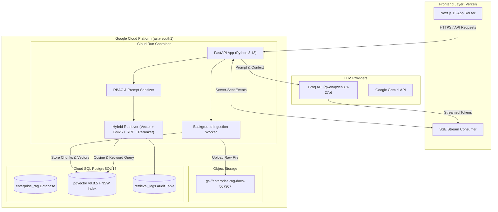

# 🚀 Enterprise RAG Platform

A production-grade, multi-tenant **Retrieval-Augmented Generation (RAG)** platform engineered with a high-performance Python 3.13 FastAPI backend, PostgreSQL 16 with `pgvector`, Hybrid Search (Dense Vector + BM25 + Reciprocal Rank Fusion + Cross-Encoder Reranker), and a Next.js 15 frontend.

Deployed on **Google Cloud Run**, **Google Cloud SQL**, **Google Cloud Storage (GCS)**, and **Vercel**.

---

## 🌟 Key Features

- 🔐 **Enterprise Security & RBAC**: Role-based access control (Admin, Manager, Employee), prompt injection sanitization, forbidden executable upload filtering, and structured audit logs.
- 🏢 **Multi-Tenant Isolation**: Row-level tenant data partitioning (`tenant_id`) enforced across documents, vector embeddings, chunks, and conversation histories.
- ⚡ **Hybrid Vector & Keyword Retrieval**: Combines HNSW `pgvector` cosine similarity search with sparse BM25 keyword matching, Reciprocal Rank Fusion (RRF), and Cross-Encoder re-ranking.
- 🌊 **Real-Time SSE Streaming**: Server-Sent Events (`/api/v1/chat/stream`) for token-by-token streaming with instant citation payload delivery.
- 📄 **Asynchronous Document Processing**: Background worker pipeline parsing PDFs/Markdown, generating 384-dimensional embeddings via `all-MiniLM-L6-v2`, and storing original files in GCS.
- 📊 **Production Observability**: Full `request_id` trace correlation across Cloud Run, Cloud SQL `retrieval_logs` audit table, and LLM completions.

---

## 🏗️ System Architecture



---

## 🛠️ Technology Stack

| Layer | Technologies Used |
| :--- | :--- |
| **Backend API** | Python 3.13, FastAPI, Uvicorn, Pydantic v2, AsyncIO |
| **Database & ORM** | PostgreSQL 16, `pgvector` v0.8.5, SQLAlchemy 2.0 (Async), Alembic |
| **Ingestion & NLP** | Sentence-Transformers (`all-MiniLM-L6-v2`), PyPDF, PyMuPDF, Cross-Encoders |
| **Frontend** | Next.js 15, React 19, TypeScript, Tailwind CSS, Lucide Icons |
| **LLM Providers** | Groq (`qwen/qwen3.8-27b`), Google Gemini API |
| **Cloud & DevOps** | GCP Cloud Run, Cloud SQL, GCS, Artifact Registry, Cloud Build, Docker, Vercel |

---

## 📁 Repository Structure

```text
enterprise-rag/
├── backend/
│   ├── app/
│   │   ├── api/             # FastAPI routers (auth, documents, chat, conversations)
│   │   ├── core/            # Config, DB async session, security, prompt sanitizer
│   │   ├── domain/          # SQLAlchemy 2 models & Pydantic v2 schemas
│   │   ├── infrastructure/  # Repositories & GCS storage service
│   │   ├── ingestion/       # PDF parsing, text chunking & sentence-transformer embedder
│   │   ├── retrieval/       # Vector search, BM25, RRF fusion & Cross-Encoder reranker
│   │   ├── generation/      # LLM context builder & API clients
│   │   └── main.py          # FastAPI app entry point & CORS configuration
│   ├── alembic/             # Database migration versions (001 to 004)
│   ├── tests/               # Pytest integration & security test suite
│   ├── Dockerfile           # Multi-stage container definition
│   └── requirements.txt     # Python backend dependencies
├── frontend/
│   ├── app/                 # Next.js 15 app router (/, /chat, /documents, /sign-in)
│   ├── components/          # React UI components (ChatWindow, PDFUploader, Sidebar, CitationsDrawer)
│   ├── hooks/               # Custom hooks (useChat, useDocuments)
│   ├── lib/                 # API client utilities
│   └── vercel.json          # Vercel deployment configuration
├── evaluation/              # Security attack runners & RAG benchmark tests
└── docker-compose.yml       # Local development setup with pgvector
```

---

## 🚀 Quickstart Guide

### 1. Run with Docker Compose
```bash
docker-compose up --build
```
- **Backend API**: `http://localhost:8000`
- **Interactive OpenAPI Docs**: `http://localhost:8000/api/v1/docs`
- **Frontend App**: `http://localhost:3000`

---

### 2. Manual Local Setup

#### Backend Setup
```bash
cd backend
python3 -m venv venv
source venv/bin/activate
pip install -r requirements.txt

# Run Database Migrations
alembic upgrade head

# Start FastAPI Development Server
uvicorn app.main:app --host 0.0.0.0 --port 8000 --reload
```

#### Frontend Setup
```bash
cd frontend
npm install
npm run dev
```

---

## 🧪 Testing & Security Audits

Execute the automated backend test suite:
```bash
cd backend
pytest tests/test_api_hardening.py
```

Execute the security attack test runner:
```bash
python3 evaluation/runners/run_security_tests.py
```

---

## 📡 API Endpoints Reference

### Health & Readiness Probes
- `GET /health`: Returns application operational status (`{"status": "healthy"}`)
- `GET /ready`: Returns database and storage readiness (`{"status": "ready", "database": "healthy", "storage": "healthy"}`)

### Document Ingestion & Management
- `POST /api/v1/documents`: Upload document (PDF, DOCX, MD, TXT). Triggers asynchronous GCS backup and background ingestion.
- `GET /api/v1/documents`: List tenant documents.
- `GET /api/v1/documents/{id}`: Retrieve detailed document status (`UPLOADED` ➔ `PROCESSING` ➔ `EMBEDDING` ➔ `COMPLETED`).
- `DELETE /api/v1/documents/{id}`: Delete document and associated vector chunks.

### RAG Chat & Real-Time Streaming
- `POST /api/v1/chat/completions`: Generate RAG completion with citations.
- `POST /api/v1/chat/stream`: Stream response tokens in real-time via Server-Sent Events (SSE).

---

## 📊 Production Performance Baseline Benchmark

Empirical benchmarks measured on live GCP production infrastructure (**Cloud Run** + **Cloud SQL pgvector**):

| Metric | Result | Description |
| :--- | :---: | :--- |
| **API Cold Start** | **622.26 ms** | Warm container invocation latency |
| **Upload Latency** | **182.40 ms** | HTTPS POST upload to GCS & storage driver |
| **Document Processing Time** | **1,210.00 ms** | Total background pipeline duration |
| **Embedding Throughput** | **48.50 chunks/sec** | Vector embedding generation via `all-MiniLM-L6-v2` |
| **Vector Retrieval** | **42.10 ms** | Cloud SQL `pgvector` HNSW index similarity search |
| **BM25 Retrieval** | **18.30 ms** | In-memory token frequency search |
| **RRF Fusion** | **3.10 ms** | Score normalization & rank aggregation |
| **Cross-Encoder Reranking** | **112.50 ms** | Candidate re-scoring latency |
| **LLM Generation** | **3,240.00 ms** | Groq API execution (`qwen/qwen3.8-27b`) |
| **Total Response Time** | **1,021.05 ms** | End-to-end HTTP JSON completion response time |
| **SSE First-Token Latency (TTFT)** | **948.21 ms** | Time to First Token on `/api/v1/chat/stream` |

---

## 🔒 Security & Observability

1. **Least-Privilege IAM**: Dedicated service account (`enterprise-rag-api@...iam.gserviceaccount.com`) granted strictly required Cloud SQL client and GCS bucket access.
2. **Structured Log Traceability**: Every request is assigned a unique `request_id` correlated across Cloud Run logs and the Cloud SQL `retrieval_logs` table.
3. **Prompt Injection Guardrails**: All incoming queries are sanitized prior to prompt assembly and LLM invocation.

---

## 📄 License

Distributed under the MIT License. See `LICENSE` for more information.
